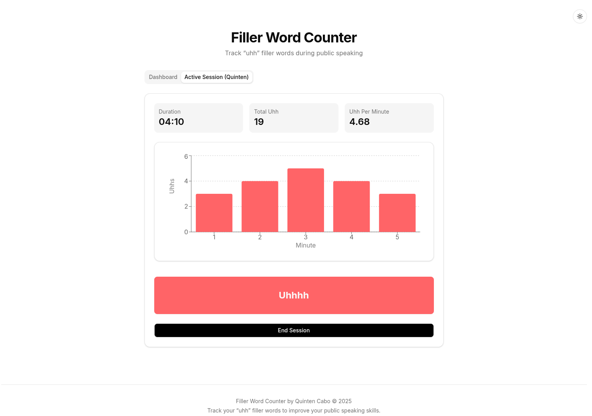
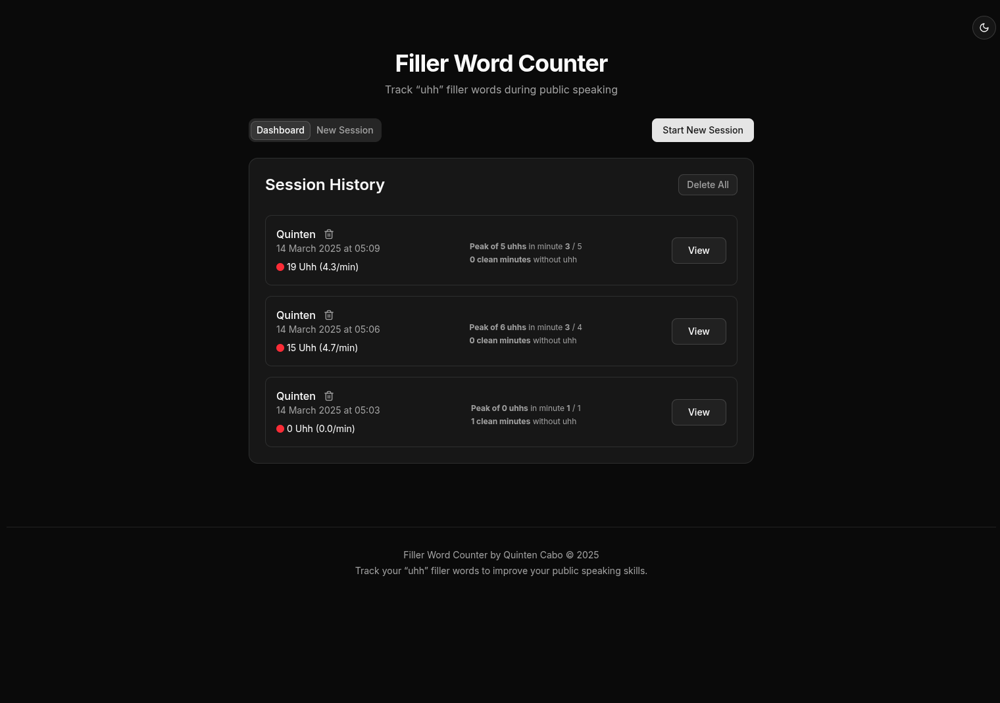

# Filler Word Counter 

A simple web application to help speakers track and analyze filler words like "uhh" during presentations and public speaking sessions. 
Improve your speaking skills by becoming aware of your filler word usage patterns.

<div style="display: flex; ">
<div></div>
<div></div>
</div>

## Features

- **Real-time Tracking**: Track "uhh" filler words in real-time with simple button presses
- **Comprehensive Statistics**:
  - Total filler word count
  - Average filler words per minute
  - Peak usage identification (highest number of filler words in a minute)
  - Clean minutes tracking (minutes with zero filler words)
  - Worst minute identification
- **Visual Analytics**: Visualize filler word usage with interactive histograms
- **Session Management**:
  - Create multiple named sessions
  - View active and completed sessions
  - End active sessions when complete
  - Delete individual sessions
  - Bulk delete all sessions
- **Persistent Storage**: 
   - All data is stored in localStorage 
   - Detection if you forgot to stop a session
- **Responsive Design**: Works on desktop and mobile devices
- **Dark/Light Mode**: Supports system theme preferences

## Getting Started

### Prerequisites

- Node.js 18.0 or later
- npm or bun

### Installation

1. Clone the repository:
   ```bash
   git clone https://github.com/tintin10q/filler-word-counter.git
   cd filler-word-counter
   ```

2. Install dependencies:
   ```bash
   npm install
   # or
   bun install
   ```

3. Run the development server:
   ```bash
   npm run dev
   # or
   bun dev
   ```

4. Open [http://localhost:3000](http://localhost:3000) in your browser

## Usage

1. **Start a New Session**:
   - Click "Start New Session" on the homepage
   - Enter a descriptive name for your session (e.g., "Practice Presentation")
   - Click "Start" to begin tracking

2. **During Your Speech**:
   - Press the "Uhh" button each time you or the speaker uses a filler word
   - The application will record the timestamp and update statistics in real-time
   - View the live histogram to see your filler word distribution

3. **End Your Session**:
   - Click "End Session" when your speech is complete
   - Review your detailed statistics

4. **Analyze Your Results**:
   - View comprehensive statistics for each session
   - Identify patterns in your filler word usage
   - Track improvement over time by comparing multiple sessions

5. **Manage Sessions**:
   - View all sessions in the Session History
   - Click "View" to see detailed statistics for any session
   - Delete sessions using the trash icon
   - Use "Delete All" to remove all sessions at once

## Technologies Used

- [Next.js](https://nextjs.org/) - React framework for production
- [TypeScript](https://www.typescriptlang.org/) - Type-safe JavaScript
- [Tailwind CSS](https://tailwindcss.com/) - Utility-first CSS framework
- [shadcn/ui](https://ui.shadcn.com/) - Accessible and customizable UI components
- [Lucide Icons](https://lucide.dev/) - Beautiful open-source icons
- [Recharts](https://recharts.org/) - Composable charting library for React


## Contributing

Contributions are welcome! Please feel free to submit a Pull Request.
